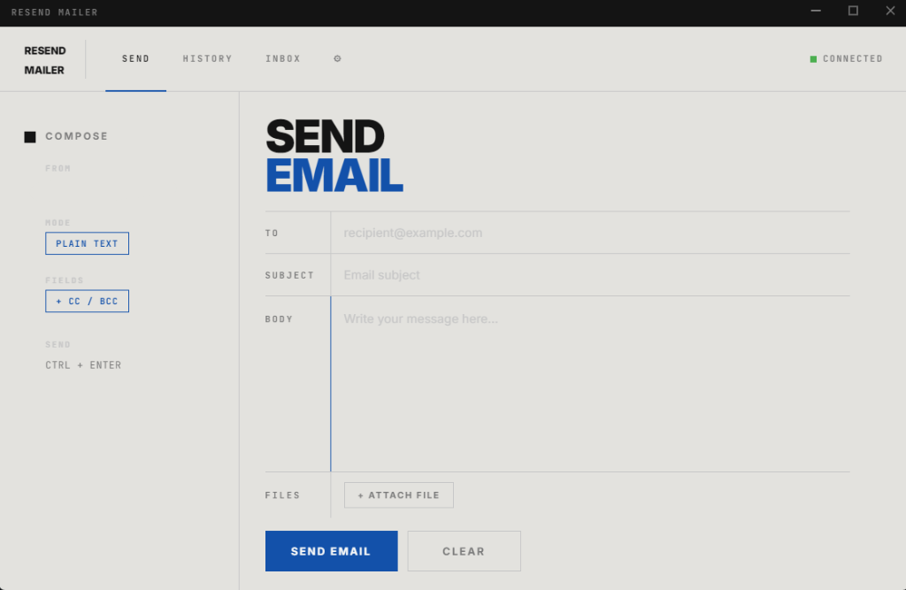

# Resend Mailer GUI

A beautiful, modern, and secure desktop email client built with Electron and powered by the **Resend API**.



## Features

- **Send Emails:** Supports HTML/Plain text modes, CC, BCC, and multiple file attachments.
- **Sent History:** Local history log of your sent messages stored securely in the browser environment.
- **Inbox (Received Emails):** Fetch and read received emails in real-time via Resend's receiving REST API.
- **Secure Configuration:** Your sensitive credentials (like the Resend API Key) are stored locally in the OS data directory (`userData/config.json`) and are never bundled into the installer or pushed to version control.
- **Modern Frameless UI:** A premium, minimal, and responsive custom-styled desktop interface.

## Tech Stack

- **Core:** Electron, HTML5, Vanilla CSS3, JavaScript (ES6)
- **Email Service:** [Resend SDK](https://resend.com)
- **Environment variables:** dotenv

## Installation & Setup

1. **Clone the repository:**
   ```bash
   git clone https://github.com/xDath/resend-mail-gui.git
   cd resend-mail-gui
   ```

2. **Install dependencies:**
   ```bash
   npm install
   ```

3. **Development Mode:**
   To run the app in development:
   ```bash
   npm start
   ```

4. **Production Build:**
   To pack and build the standalone Windows executable:
   ```bash
   npm run build
   ```

## Configuration

On the first launch, the app creates a secure configuration file in your system's AppData directory:
- **Windows:** `%APPDATA%/resend-mailer/config.json`

Go to the **Settings (⚙)** tab inside the app UI to set up your credentials:
- **API Key:** Your Resend API Key (starts with `re_`).
- **Sender Email:** The verified sender email domain or `onboarding@resend.dev`.
- **Sender Name:** The name display for your emails.
- **Reply To:** Optional reply-to address.
- **Notify Email:** Optional Gmail address to receive incoming mail notifications.

## License

This project is open-source and available under the [MIT License](LICENSE).
